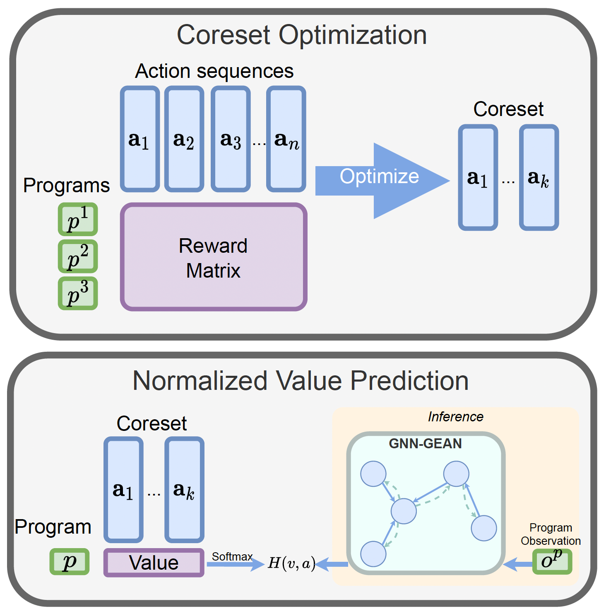

In the [paper](https://arxiv.org/abs/2301.05104), we demonstrated a simple yet effective pipeline for pass ordering for program size reduction. To achieve this, we first identify a small set (termed coreset) of pass sequences that generally optimize the size of most programs. Then, a policy is learned to pick the optimal sequences by predicting the normalized values of the pass sequences in the coreset. 

The policy can be as simple as a multi-layer perceptron (MLP) that leverages the Autophase feature of a program. It can also be a graph neural network (GNN) that exploits the ProGraML graph of the program to predict the optimal pass sequence.

Our code for the paper is going to be hosted on [https://github.com/facebookresearch/RLCompOpt](https://github.com/facebookresearch/RLCompOpt).
